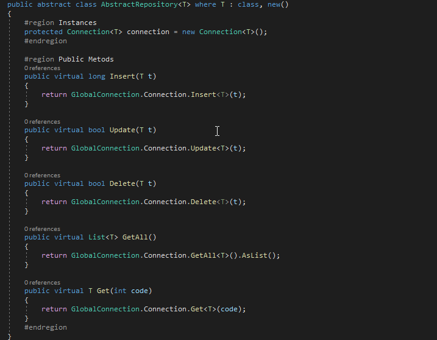

# UDDS - Util DLL Data SQLite 
> Increase productivity when developing applications with SQLite

Need to create a new data structure in all your applications with SQLite? use Util DLL Data SQLite and save time!


## Installation

In your project:
 
```sh
Import UDDS.dll for your project
Import dapper and dapper.Contrib(nuget)
```

## Usage example
Create your model User and add Atributte Table and Key in your class (Dapper.Contrib) 
```sh
[Table("User")]
    public class User
    {
        [Key]
        public int ID { get; set; }
        public string Name { get; set; }
    }

```
Create your user repository and add extend of AbstractRepository<T> (UDDS.dll ) 
```sh
    public class UserRepository : AbstractRepository<User>
    {
    }

```

Add in your program.cs the create database (UDDS.dll ) 
```sh
     var list = new List<Type>();
     list.Add(new User().GetType());         
     new SQLUtil().CreateDatabase(list);
```

The user's crud methods are now available to use in your project! :)

## Development setup

```sh
Open project in Visual Studio
Load Dependencies
```

## Usage: 
    C# Generics
    C# Reflection
    Dapper
    Dapper.Contrib
    SQLite

## Release History

* 0.0.1
    * The first proper release
    * Work in progress

## Meta

Zanchet Luan – [@zanchetluan](https://twitter.com/zanchetluan) – luuanzanchet@outlook.com


[https://github.com/LuanZanchet/UtilDataSQLite](https://github.com/LuanZanchet)

## Contributing

1. Fork it (<https://github.com/LuanZanchet/UtilDataSQLite/fork>)
2. Create your feature branch (`git checkout -b feature/fooBar`)
3. Commit your changes (`git commit -am 'Add some fooBar'`)
4. Push to the branch (`git push origin feature/fooBar`)
5. Create a new Pull Request

<!-- Markdown link & img dfn's -->
[npm-image]: https://img.shields.io/npm/v/datadog-metrics.svg?style=flat-square
[npm-url]: https://npmjs.org/package/datadog-metrics
[npm-downloads]: https://img.shields.io/npm/dm/datadog-metrics.svg?style=flat-square
[travis-image]: https://img.shields.io/travis/dbader/node-datadog-metrics/master.svg?style=flat-square
[travis-url]: https://travis-ci.org/dbader/node-datadog-metrics
[wiki]: https://github.com/yourname/yourproject/wiki
